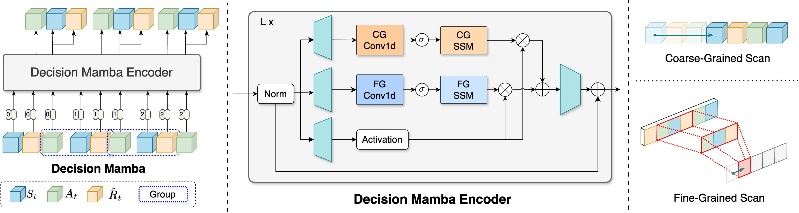
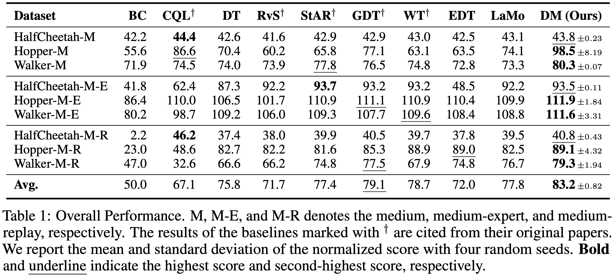

<div align="center">
<h2>Decision Mamba: A Multi-Grained State Space Model with Self-Evolution Regularization for Offline RL</h2>

[**Qi Lv**](https://aopolin-lv.github.io/)<sup>1,2</sup> · [**Xiang Deng**](https://xiang-deng-dl.github.io/)<sup>1&dagger;</sup> · [**Gongwei Chen**](https://scholar.google.com/citations?user=Mpg0w3cAAAAJ)<sup>1</sup> · [**Michael Yu Wang**](https://scholar.google.com/citations?user=Oo7c22wAAAAJ&hl=zh-CN)<sup>2</sup> · [**Liqiang Nie**](https://liqiangnie.github.io/)<sup>1&dagger;</sup>

<sup>1</sup>Harbin Institute of Technology (Shenzhen)&emsp;&emsp;&emsp;&emsp;<sup>2</sup>Great Bay University&emsp;&emsp;&emsp;&emsp;

<sup>&dagger;</sup>corresponding author

**NeurIPS 2024**

<a href="https://arxiv.org/abs/2406.05427"></a>
</div>

This work presents Decision Mamba (DM), a novel multi-grained state space model (SSM) with a self-evolving policy learning strategy. DM explicitly models the historical hidden state to extract the temporal information by using the mamba architecture. To capture the relationship among state-action-RTG triplets, a fine-grained SSM module is designed and integrated into the original coarse-grained SSM in mamba, resulting in a novel mamba architecture tailored for offline RL. Finally, to mitigate the overfitting issue on noisy trajectories, a self-evolving policy is proposed by using progressive regularization. The policy evolves by using its own past knowledge to refine the suboptimal actions, thus enhancing its robustness on noisy demonstrations.

**Framework**


**The action distribution of polices trained on the different noisy data**


## Performance
Here we present the performance comparsion between DM and baseline models.




## Usage 

### Installation
#### 1. Install MuJoCo
First, you need to download the file from this [link](https://mujoco.org/download/mujoco210-linux-x86_64.tar.gz) and `tar -xvf the_file_name` in the `~/.mujoco` folder. Then, run the following commands.
```bash
cd experiment-d4rl
conda env create -f env.yml
```
If you encounter errors brought by `mamba_ssm` and `causal_conv1d`, we suggest you downloading the source code and install manually.
The versions are as follows:
```
mamba-ssm==1.2.0.post1
causal-conv1d==1.2.0.post2
```
After that, add the following lines to your `~/.bashrc` file:
```bash
export LD_LIBRARY_PATH=$LD_LIBRARY_PATH:/YOUR_PATH_TO_THIS/.mujoco/mujoco210/bin
export LD_LIBRARY_PATH=$LD_LIBRARY_PATH:/usr/lib/nvidia
```
Remember to `source ~/.bashrc` to make the changes take effect.

#### 2. Install D4RL
Install D4RL by following the guidance in [D4RL](https://github.com/Farama-Foundation/D4RL).

#### 3. Install transformers
Install `transformers` package with:
```bash
cd transformers
pip install -e .
```

We also provide the `requirements.txt` and `environment.yaml` for installing or checking the packages.

#### 3. Dataset
To download original D4RL data, 
```bash
cd data
python download_d4rl_datasets.py
```

### Run
```bash
sh run.sh hopper medium 0 0.85
```

## Acknowledgement
**DM** is based on many open-source projects, including [Decision Transformer](https://github.com/kzl/decision-transformer), [Can Wikipedia Help Offline Reinforcement Learning](https://github.com/machelreid/can-wikipedia-help-offline-rl), [LaMo](https://github.com/srzer/LaMo-2023), [LoRA](https://github.com/microsoft/LoRA), [DeFog](https://github.com/hukz18/DeFog). We thank all these authors for their nicely open sourced code and their great contributions to the community.

## License
DM is licensed under the MIT license. See the [LICENSE](LICENSE) file for details.

## Citation
If you find this project useful, please consider citing:

```bibtex
@inproceedings{lv2024dmn,
    title     = {Decision Mamba: A Multi-Grained State Space Model with Self-Evolution Regularization for Offline RL},
    author    = {Qi Lv and Xiang Deng and Gongwei Chen and Michael Yu Wang and Liqiang Nie},
    booktitle = {38th Annual Conference on Neural Information Processing Systems},
    year      = {2024}
}
```