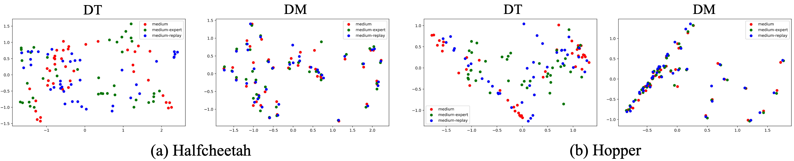

<div align="center">
<h2>Decision Mamba: A Multi-Grained State Space Model with Self-Evolution Regularization for Offline RL</h2>

[**Qi Lv**](https://aopolin-lv.github.io/)<sup>1,2</sup> · [**Xiang Deng**](https://xiang-deng-dl.github.io/)<sup>1&dagger;</sup> · [**Gongwei Chen**](https://scholar.google.com/citations?user=Mpg0w3cAAAAJ)<sup>1</sup> · [**Michael Yu Wang**](https://scholar.google.com/citations?user=Oo7c22wAAAAJ&hl=zh-CN)<sup>2</sup> · [**Liqiang Nie**](https://liqiangnie.github.io/)<sup>1&dagger;</sup>

<sup>1</sup>Harbin Institute of Technology (Shenzhen)&emsp;&emsp;&emsp;&emsp;<sup>2</sup>Great Bay University&emsp;&emsp;&emsp;&emsp;

<sup>&dagger;</sup>corresponding author

**NeurIPS 2024**

<a href="https://arxiv.org/abs/2406.05427"></a>
</div>

This work presents Decision Mamba (DM), a novel multi-grained state space model (SSM) with a self-evolving policy learning strategy. DM explicitly models the historical hidden state to extract the temporal information by using the mamba architecture. To capture the relationship among state-action-RTG triplets, a fine-grained SSM module is designed and integrated into the original coarse-grained SSM in mamba, resulting in a novel mamba architecture tailored for offline RL. Finally, to mitigate the overfitting issue on noisy trajectories, a self-evolving policy is proposed by using progressive regularization. The policy evolves by using its own past knowledge to refine the suboptimal actions, thus enhancing its robustness on noisy demonstrations.

**Framework**


**The action distribution of polices trained on the different noisy data**


## Performance
Here we present the performance comparsion between DM<sup>2</sup> and baseline models.


| Dataset | BC | CQL<sup>&dagger;</sup> | DT | RvS<sup>&dagger;</sup> | StAR<sup>&dagger;</sup> | GDT<sup>&dagger;</sup> | WT<sup>&dagger;</sup> | EDT | LaMo | DM (Ours) |
|---|--:|--:|--:|--:|--:|--:|--:|--:|--:|--:|
| HalfCheetah-M | 42.2 | 44.4 | 42.6 | 41.6 | 42.9 | 42.9 | 43.0 | 42.5 | 43.1 | 43.8±0.23 |
| Hopper-M | 55.6 | 86.6 | 70.4 | 60.2 | 65.8 | 77.1 | 63.1 | 63.5 | 74.1 | 98.5±8.19 |
| Walker-M | 71.9 | 74.5 | 74.0 | 73.9 | 77.8 | 76.5 | 74.8 | 72.8 | 73.3 | 80.3±0.07 |
| HalfCheetah-M-E | 41.8 | 62.4 | 87.3 | 92.2 | 93.7 | 93.2 | 93.2 | 48.5 | 92.2 | 93.5±0.11 |
| Hopper-M-E | 86.4 | 110.0 | 106.5 | 101.7 | 110.9 | 111.1 | 110.9 | 110.4 | 109.9 | 111.9±1.84 |
| Walker-M-E | 80.2 | 98.7 | 109.2 | 106.0 | 109.3 | 107.7 | 109.6 | 108.4 | 108.8 | 111.6±3.31 |
| HalfCheetah-M-R | 2.2 | 46.2 | 37.4 | 38.0 | 39.9 | 40.5 | 39.7 | 37.8 | 39.5 | 40.8±0.43 |
| Hopper-M-R | 23.0 | 48.6 | 82.7 | 82.2 | 81.6 | 85.3 | 88.9 | 89.0 | 82.5 | 89.1±4.32 |
| Walker-M-R | 47.0 | 32.6 | 66.6 | 66.2 | 74.8 | 77.5 | 67.9 | 74.8 | 76.7 | 79.3±1.94 |
| Avg. | 50.0 | 67.1 | 75.8 | 71.7 | 77.4 | 79.1 | 78.7 | 72.0 | 77.8 | 83.2±0.82 |

<sup>&dagger;</sup> denotes the results are cited from the original paper.


## Usage 

### Installation
#### 1. Install MuJoCo
First, you need to download the file from this [link](https://mujoco.org/download/mujoco210-linux-x86_64.tar.gz) and `tar -xvf the_file_name` in the `~/.mujoco` folder. Then, run the following commands.
```bash
cd experiment-d4rl
conda env create -f env.yml
```
After that, add the following lines to your `~/.bashrc` file:
```bash
export LD_LIBRARY_PATH=$LD_LIBRARY_PATH:/YOUR_PATH_TO_THIS/.mujoco/mujoco210/bin
export LD_LIBRARY_PATH=$LD_LIBRARY_PATH:/usr/lib/nvidia
```
Remember to `source ~/.bashrc` to make the changes take effect.

#### 2. Install D4RL
Install D4RL by following the guidance in [D4RL](https://github.com/Farama-Foundation/D4RL).

#### 3. Dataset
To download original D4RL data, 
```bash
cd data
python download_d4rl_datasets.py
```

### Run
```
sh run.sh hopper medium 0 0.85
```

## Acknowledgement
**DM** is based on many open-source projects, including [Decision Transformer](https://github.com/kzl/decision-transformer), [Can Wikipedia Help Offline Reinforcement Learning](https://github.com/machelreid/can-wikipedia-help-offline-rl), [LaMo](https://github.com/srzer/LaMo-2023), [LoRA](https://github.com/microsoft/LoRA), [DeFog](https://github.com/hukz18/DeFog). We thank all these authors for their nicely open sourced code and their great contributions to the community.

## License
**DM** is licensed under the MIT license. See the [LICENSE](LICENSE) file for details.

## Citation
If you find this project useful, please consider citing:

```bibtex
@inproceedings{lv2024DM,
    title     = {Decision Mamba: A Multi-Grained State Space Model with Self-Evolution Regularization for Offline RL},
    author    = {Qi Lv and Xiang Deng and Gongwei Chen and Michael Yu Wang and Liqiang Nie},
    booktitle = {38th Annual Conference on Neural Information Processing Systems},
    year      = {2024}
}
```